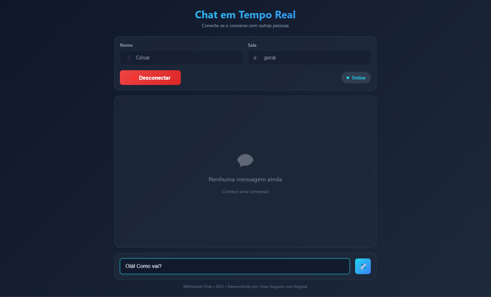
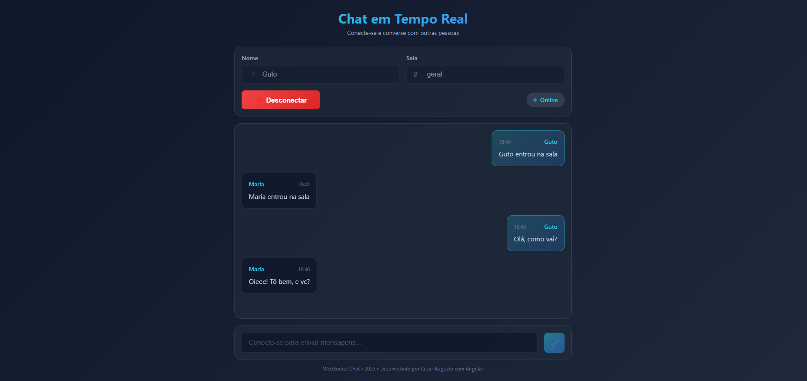

# 💬 Chat em Tempo Real - Backend

Servidor que permite comunicação em tempo real entre usuários através de WebSocket.






## 🛠️ Feito com

- Java 21
- Spring Boot 3.5.8
- WebSocket

## 📝 O que você precisa ter instalado

- Java 21
- Maven

## 🚀 Como rodar o projeto

**Opção 1: Usando Maven**
```bash
mvn spring-boot:run
```

**Opção 2: Gerando JAR e executando**
```bash
mvn clean package
java -jar target/chat-0.0.1-SNAPSHOT.jar
```

O servidor vai iniciar em: `http://localhost:8080`

## 📂 Estrutura do projeto

```
src/main/java/br/com/sistema/chat/
├── config/           # Configurações do WebSocket e CORS
├── controller/       # Controla as mensagens do chat
├── model/           # Modelo da mensagem (ChatMessage)
└── ChatApplication  # Arquivo principal
```

## 💡 Como funciona

1. O cliente (frontend) conecta no servidor
2. Usuário escolhe uma sala para conversar
3. Quando envia uma mensagem, ela é transmitida para todos na mesma sala
4. Todos recebem a mensagem em tempo real

## 🔌 Endpoints importantes

- **Conectar**: `/ws`
- **Enviar mensagem**: `/app/chat.send/{sala}`
- **Receber mensagens**: `/topic/chat/{sala}`

## 📋 Formato da mensagem

```json
{
  "from": "Nome do usuário",
  "content": "Texto da mensagem",
  "timestamp": "2024-12-17T18:30:00"
}
```

## ⚙️ Configuração

### Porta do servidor
Por padrão roda na porta **8080**. Para mudar, edite `application.properties`:
```properties
server.port=8080
```

### Permitir acesso do frontend
O CORS já está configurado para aceitar requisições de:
- `http://localhost:4200` (Angular)

## ❗ Problemas comuns

**Porta 8080 já está em uso?**
- Feche outros programas usando essa porta
- Ou mude a porta no `application.properties`

**Erro de CORS?**
- Verifique se o frontend está rodando em `localhost:4200`
- Ou adicione a nova URL em `CorsConfig.java`

**Mensagens não chegam?**
- Confirme que o cliente está conectado
- Verifique se está enviando para a sala correta

## 🐳 Rodando com Docker (opcional)

1. Crie um arquivo `Dockerfile`:
```dockerfile
FROM eclipse-temurin:21-jdk-alpine
WORKDIR /app
COPY target/chat-0.0.1-SNAPSHOT.jar app.jar
EXPOSE 8080
ENTRYPOINT ["java","-jar","app.jar"]
```

2. Rode os comandos:
```bash
mvn clean package
docker build -t chat-backend .
docker run -p 8080:8080 chat-backend
```

## 📦 Dependências

- **spring-boot-starter-web** - Para criar a API REST
- **spring-boot-starter-websocket** - Para WebSocket
- **spring-boot-starter-validation** - Para validar dados
- **spring-boot-starter-test** - Para testes

---
